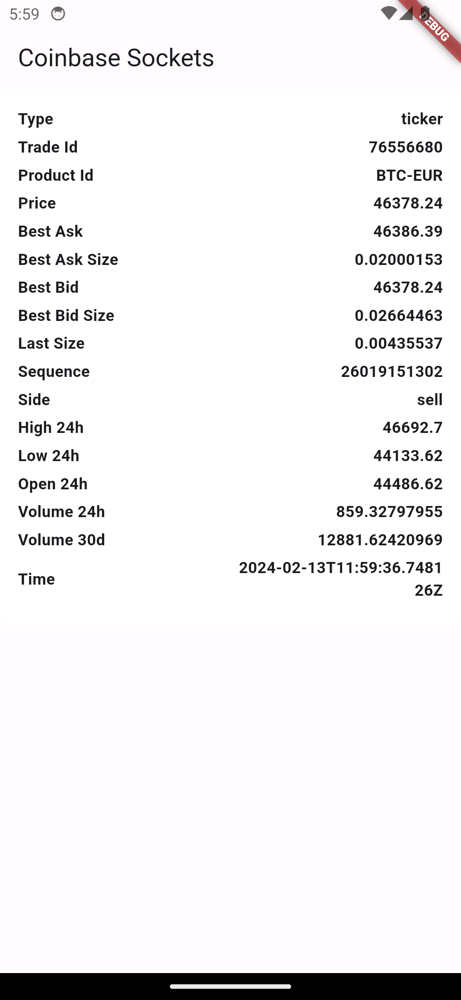

# Coinbase Socket Example

## Description
This is a Flutter app that demonstrates how to use WebSockets to fetch real-time BTC-EUR trading data from the Coinbase Pro API. The app displays various parameters such as price, best ask and bid sizes, last size, high and low 24h, open 24h, volume 24h and 30d, and more. The app is intended for educational purposes and does not provide any investment advice.


## Features
- Real-time data fetching using WebSocket from Coinbase Pro API.
- Display of live trading data including Trade ID, Price, Best Ask and Bid sizes, Last Size, High and Low 24h, Open 24h, Volume 24h and 30d.
- Clean and user-friendly interface for traders and crypto enthusiasts.


## Screenshots



## Installation
To run this Flutter project, you will need to have the following software installed on your system:

- Flutter SDK version 3.3.9
- Dart SDK version 2.18.5

Clone the repository:
```bash
git clone https://github.com/rifathossain82/coinbase-sockets
```

Navigate to the project directory and run this command in your terminal
```base
flutter pub get
flutter run
```


## Usage
Once the app is running, you will see a screen with the title “Coinbase Sockets” and a list of trading data for the BTC-EUR pair. The data is updated in real-time as new trades occur on the Coinbase Pro platform. You can scroll through the list to see different parameters and their values. You can also tap on any parameter to see more details about it.


## Credits
This app uses the following packages:

[web_socket_channel](https://pub.dev/packages/web_socket_channel): A cross-platform WebSocket channel that provides a StreamChannel interface for WebSocket connections.

And the original source code from **[@Vanethos](https://github.com/Vanethos)**


## License
This project is licensed under the MIT License - see the LICENSE file for details.